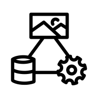
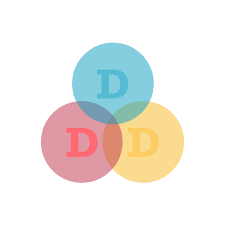
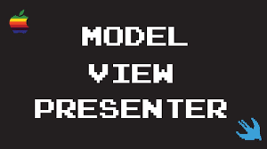

  

    

      <a href="/architectural-pattern/model-view-controller">
        
        <h3>Model View Controller(MVC)</h3>
      </a>
    

  

    

    

      <a href="/architectural-pattern/domain-driven-design">
        
        <h3>Domain Driven Design(DDD)</h3>
        &nbsp;
        </a>
    

  

    

    

      <a href="/architectural-pattern/hexagonal-architecture">
        
        <h3>Hexagonal</h3>
      </a>
    

  

  

    

      <a href="/architectural-pattern/mvp">
        
        <h3>MVP (Model View Presenter)</h3>
        &nbsp;
      </a>
    

  

  

    

      <a href="/architectural-pattern/static-content-hosting">
        
        <h3>Static Content Hosting</h3>
        &nbsp;
      </a>
    

  

 

    

      <a href="/architectural-patterns/backend-for-frontend">
        
        <h3>Backend For Frontend(BFF)</h3>
        &nbsp;
      </a>
    

  

  <!-- Add more buttons similarly -->

