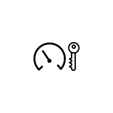
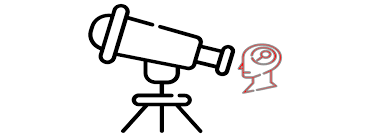
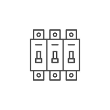
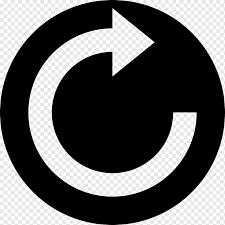
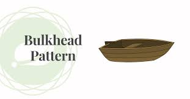
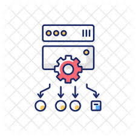
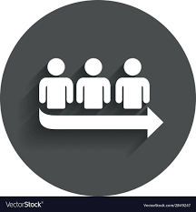
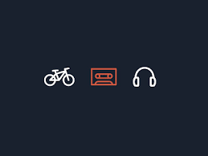
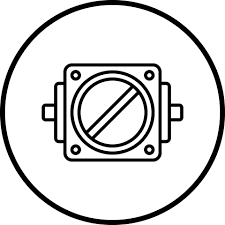

  

    

      <a href="/design-pattern/rate-limitor">
        
        <h3>Rate Limiter</h3>
      </a>
    

  

  

    

      <a href="/design-patterns/observer">
        
        <h3>Observer</h3>
      </a>
    

  

  

    

      <a href="/design-patterns/circuit-breaker">
        
        <h3>Circuit Breaker</h3>
      </a>
    

  

  

    

      <a href="/design-patterns/retry">
        
        <h3>Retry</h3>
      </a>
    

  

  

    

      <a href="/design-patterns/ambassador">
        
        <h3>Ambassador</h3>
      </a>
    

  

  

    

      <a href="/design-patterns/bulkhead">
        
        <h3>Bulkhead</h3>
      </a>
    

  

  

    

      <a href=" /design-pattern/load-balancer">
        
        <h3>Load Balancer</h3>
      </a>
    

  

  

    

      <a href="/design-patterns/queue-based-load-leveling">
        
        <h3>Queue Based Load Leveling</h3>
      </a>
    

  

  

    

      <a href="/design-patterns/sidecar-pattern">
        
        <h3>Sidecar</h3>
      </a>
    

  

  

    

      <a href="/design-patterns/throttling">
        
        <h3>Throttling</h3>
      </a>
    

  

