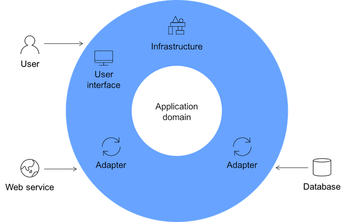

# Domain-Driven Design (DDD)

Domain-Driven Design (DDD) is a set of principles that focuses on creating complex software systems by placing a strong emphasis on understanding and modeling the domain of the problem being solved.

DDD aims to bridge the gap between technical implementation and the real-world domain in which the software operates.

## Overview

DDD emphasizes understanding and modeling the problem domain, allowing developers to create software systems that closely align with the real-world domain. It includes principles and patterns for designing and implementing domain models, bounded contexts, and aggregates.

## Benefits

- **Clear Communication with Domain Experts:** It enables clear and effective communication between technical and non-technical stakeholders.
- **Reduced Complexity:** It helps reduce complexity by breaking down the domain into smaller, manageable components.
- **Testability and Quality:** DDD's emphasis on modeling and separating concerns makes it easier to write meaningful unit tests.

## Tangible Things to Do for Adoption

1. **Domain Discovery and Modeling:**
   - **Engage Domain Experts:** Collaborate closely with domain experts to understand the problem domain thoroughly.
   - **Create a Domain Model:** Develop a conceptual model that represents the key entities, value objects, aggregates, and relationships within the domain.

2. **Bounded Contexts and Separation:**
   - **Identify Bounded Contexts:** Analyze the different areas of your application and identify distinct bounded contexts where different models apply.
   - **Define Aggregates:** Determine transactional and consistency boundaries for these aggregates to ensure data integrity and consistency.

3. **Domain-Driven Design Workshops:**
   - Conduct workshops or collaborative sessions with domain experts to refine the domain model, clarify business rules, and address any discrepancies between the domain and the software implementation.
