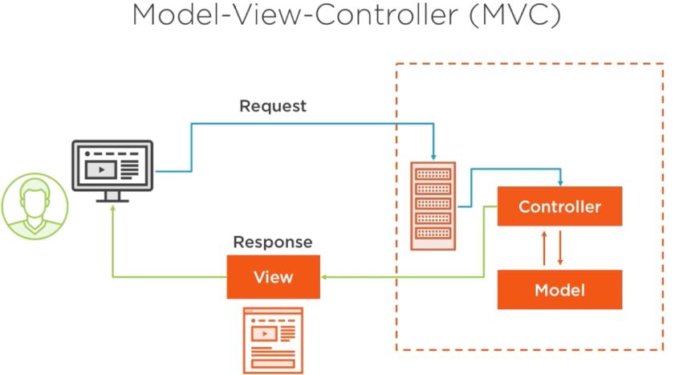

# Model-View-Controller (MVC)

Model-View-Controller (MVC) is commonly used to organize the structure of applications. It helps to separate different aspects of an application's logic, making it more modular and easier to manage.

## Overview

- **Model:** Represents the core data and logic of the application.
- **View:** Responsible for presenting the data to the user and handling the user interface components.
- **Controller:** Acts as an intermediary between the Model and the View. It receives user input from the View, processes it, and interacts with the Model accordingly.

## Benefits

- **Modularity:** MVC promotes the separation of concerns, making the application's components more independent and easier to maintain.
- **Reusability:** Each component (Model, View, and Controller) can be reused in different contexts without affecting other parts of the application.
- **Scalability:** The modular structure of MVC allows for easier scalability as different parts of the application can be modified or expanded without affecting the entire system.

## Tangible Things to Do for Adoption

1. **Component Separation:** Start by dividing your existing codebase into distinct components:
   - Identify the logic responsible for data management (DM), user interface rendering (UIR), and user interactions (UI).
   - Separate these concerns into their respective components.

2. **Implement the Communication Flow:**
   - **Model-View Interaction:** Ensure that the Model can notify the View when its data changes. You might use mechanisms like callbacks, events, or observers for this purpose.
   - **View-Controller Interaction:** Set up the View to send user input events (such as button clicks) to the Controller.
   - **Controller-Model Interaction:** The Controller can directly manipulate the Model to update data based on user actions or business logic requirements.
