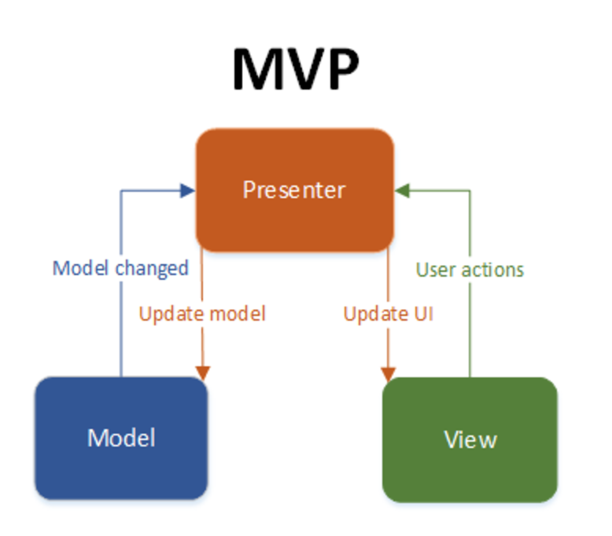

# Model-View-Presenter(MVP) 

MVP is a design pattern used in software development, especially for developing user interfaces. It separates the application into three components: Model (data and business logic), View (user interface and presentation), and Presenter (mediator between Model and View).

## Overview

MVP enforces a clear separation of concerns, with distinct components for the model (data and business logic), view (user interface), and presenter (application logic). This separation simplifies the design and maintenance of the software.

## Benefits

- **Separation of Concerns:** MVP enforces a clear separation of concerns, making the design and maintenance of the software simpler.
- **Testability:** The pattern facilitates comprehensive testing of an application, allowing for unit testing of the presenter to ensure thorough testing of application logic.
- **Modularity:** The modular structure of MVP makes it easier to develop, maintain, and extend the application, with changes in one component having minimal impact on the others.

## Tangible Things to Do for Adoption

1. **Choose a Framework or Library:**
   - Select a framework or library that supports the MVP pattern for your chosen technology stack (e.g., a web framework for web applications, a GUI framework for desktop applications).

2. **Implementation of the Model:**
   - Implement the Model component to manage data and application logic.
   - Define data structures, database interactions, and any necessary business rules.

3. **Implementation of the View:**
   - Create the View component to handle the presentation of the UI.
   - Design the user interface with a focus on layout, visual elements, and user experience.
