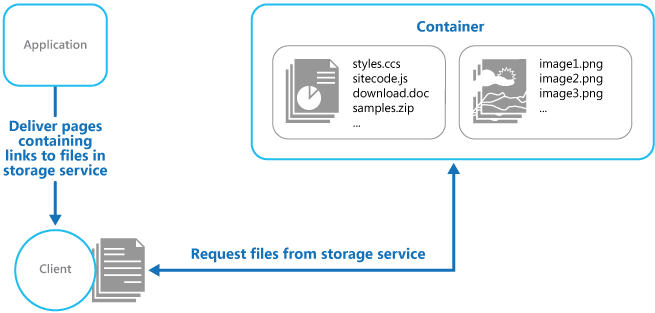

# Static Content Hosting

Static content hosting refers to the practice of serving static files, such as HTML, CSS, JavaScript, images, and other assets, from a web server. It is commonly used for websites and applications to deliver content that doesn't change dynamically for each user.

## Benefits

- **Faster Load Times:** Serving static content from dedicated hosting servers or content delivery networks (CDNs) typically results in faster load times for web pages and applications. This is crucial for providing a better user experience and reducing bounce rates.
- **Scalability:** Static content hosting services are often highly scalable. They can handle traffic spikes and high demand without straining server resources, ensuring reliable performance even during traffic surges.
- **Global Reach:** CDNs, which are commonly used for static content hosting, have a distributed network of servers across the globe. This means that static content can be cached and delivered from a server geographically closer to the user, reducing latency and improving content delivery worldwide.

## Tangible Things to Do for Adoption

1. **Identify Static Content:**
   - Identify all the static content files that your website or application uses. This includes images, stylesheets, JavaScript files, fonts, videos, and other assets that do not change dynamically.
2. **Select a Hosting Solution:**
   - Choose a static content hosting solution that suits your needs. Common options include content delivery networks (CDNs), cloud storage services, or dedicated static content hosting providers.
3. **Configure Your Hosting Service:**
   - Set up and configure your chosen hosting service. This may involve creating an account, configuring security settings, and defining storage containers or buckets for your static content.
