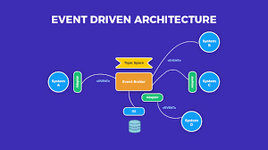

</head>
<body>
  

    <h1>Event-Driven Architecture</h1>
    
    

      <h2>Benefits</h2>
      <ul>
        <li><strong>Loose Coupling:</strong> This enhances flexibility and allows for changes to individual components without affecting the entire system.</li>
        <li><strong>Real-time Responsiveness:</strong> Event-driven systems can react in near real-time to changes and events, leading to improved responsiveness and user experience.</li>
        <li><strong>Event Logging and Auditing:</strong> Event-driven systems naturally generate event logs, which can be valuable for auditing, troubleshooting, and monitoring system behavior.</li>
        <li><strong>Flexibility and Extensibility:</strong> New components can be added as event producers or consumers without disrupting existing components.</li>
      </ul>
    

    

      <h2>Tangible Steps for Adoption</h2>
      <ol>
        <li><strong>Identify Events and Event Producers/Consumers:</strong>
          <ul>
            <li>Identify Domain Events: Analyze your system to identify relevant events that occur within the domain.</li>
            <li>Identify Producers and Consumers: Determine which components or services will produce these events and which ones will consume them.</li>
          </ul>
        </li>
        <li><strong>Select Messaging Infrastructure:</strong>
          <ul>
            <li>Choose the appropriate communication mechanisms for your event channels. This could include message queues, publish-subscribe systems, event brokers, or even HTTP-based event APIs.</li>
          </ul>
        </li>
        <li><strong>Evaluate Tools and Platforms:</strong>
          <ul>
            <li>Depending on your technology stack, evaluate messaging tools and platforms that support the chosen communication mechanisms. For example, you might consider using Apache Kafka, RabbitMQ, or cloud-based messaging services.</li>
          </ul>
        </li>
        <li><strong>Implement Event-Driven Components:</strong>
          <ul>
            <li>Implement Event Producers: These events should contain relevant data for consumers to process.</li>
            <li>Implement Event Consumers: Develop components that subscribe to specific events and process them according to the defined logic.</li>
            <li>Handle Fault Tolerance: Implement mechanisms to handle retries, dead-letter queues, and error handling.</li>
          </ul>
        </li>
      </ol>
    

  

</body>
</html>

<!-- ---
title: Event Driven

permalink: /architectural-styles/Event-Driven
layout: pagelayout
---

This pattern focuses on the flow of events, messages, and notifications between different components or services in a system. In an event-driven system, components react to events by processing the associated information and taking appropriate actions. This architecture is particularly useful for building scalable, loosely-coupled, and responsive systems.

## Benefits

- **Loose Coupling:** This enhances flexibility and allows for changes to individual components without affecting the entire system.
- **Real-time Responsiveness**: Event-driven systems can react in near real-time to changes and events, leading to improved responsiveness and user experience.
- **Event Logging and Auditing:** Event-driven systems naturally generate event logs, which can be valuable for auditing, troubleshooting, and monitoring system behavior.
- **Flexibility and Extensibility:** as new components can be added as event producers or consumers without disrupting existing components.

## How to Adopt

### Identify Events and Event Producers/Consumers:
- **Identify Domain Events:** Analyze your system to identify relevant events that occur within the domain.
- **Identify Producers and Consumers:** Determine which components or services will produce these events and which ones will consume them.
- **Select Messaging Infrastructure:**
 Choose the appropriate communication mechanisms for your event channels. This could include message queues, publish-subscribe systems, event brokers, or even HTTP-based event APIs.

### Evaluate Tools and Platforms: 
Depending on your technology stack, evaluate messaging tools and platforms that support the chosen communication mechanisms. For example, you might consider using Apache Kafka, RabbitMQ, or cloud-based messaging services.

### Implement Event-Driven Components:

- **Implement Event Producers:** These events should contain relevant data for consumers to process
- **Implement Event Consumers:** Develop components that subscribe to specific events and process them according to the defined logic.
- **Handle Fault Tolerance:** Implement mechanisms to handle retries, dead-letter queues, and error handling. -->
