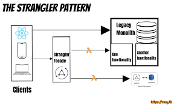

The Strangler is an architectural approach used to gradually replace or migrate from an existing system to a new one. It helps organizations transition from legacy systems to modern, cloud-native solutions in a phased and controlled manner. The Strangler pattern is particularly useful for organizations with large, complex legacy systems that want to take advantage of the benefits of cloud-native architecture, microservices, and scalability without the risks and disruptions associated with a full system replacement. It provides a structured and controlled approach to modernizing legacy systems.

## Benefits

- **Reduced Risk:** The Strangler pattern mitigates the risks associated with big-bang migrations. You can progressively replace components and validate the new system's functionality.
- **Incremental Progress:** It allows for incremental progress in migrating to a new system, making it easier to manage the process and demonstrate value along the way.
- **Minimized Downtime:** Users experience minimal disruptions as features and components are gradually moved to the new system.
- **Preservation of Investments:** The pattern leverages existing investments in the old system by reusing functionalities that don't require replacement.

## Tangible Things to Do for Adoption

1. **Conduct a thorough analysis:** Understand the architecture, components, dependencies, and pain points of your existing system. Identify the parts that need modernization or replacement.
2. **Identify "strangling points":** Determine the entry points through which requests will be intercepted and routed to the new system. These are where external systems or users interact with your software.
3. **Develop an incremental migration plan:** Outline which features or functionalities will be migrated from the old system to the new one. Start with less critical or simpler components to gain experience.
4. **Gradually redirect traffic:** Route traffic to the new system as features and components are successfully migrated.
5. **Plan for retirement:** Once all relevant features and components have been migrated, and the old system is no longer needed, plan for its retirement or decommissioning.
