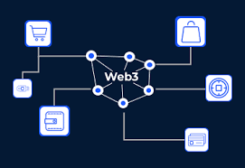

Web3 is a term associated with the development of a decentralized and blockchain-based web. It represents a vision of a more open and user-centric internet where individuals have more control over their data and digital interactions.

## Benefits

- **Decentralization:** Web3 is built on decentralized technologies, reducing reliance on centralized entities and platforms. This enhances user control over their data and online interactions.
- **Data Ownership:** Users have greater control and ownership of their data. They can store personal data on decentralized platforms and grant or revoke access as they see fit.
- **Enhanced Privacy:** Decentralization and encryption technologies in Web3 enhance user privacy. Users can interact with applications without revealing excessive personal information, reducing the risk of data breaches.

## Tangible Things to Do for Adoption

1. **Educate Yourself and Your Team:** Gain a deep understanding of Web3 concepts, including blockchain technology, cryptocurrencies, decentralized applications (dApps), and smart contracts. Educate your team and stakeholders to ensure everyone is on the same page.
2. **Identify Use Cases:** Determine how Web3 can benefit your project, industry, or organization. Identify specific use cases and applications that could leverage Web3 technologies.
3. **Select a Blockchain Platform:** Choose a blockchain platform that aligns with your project's requirements, considering factors like scalability, consensus mechanism, developer community, and ecosystem support.
