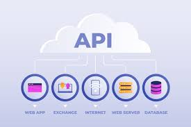

In the context of cloud computing, an API (Application Programming Interface) serves as a set of rules and protocols that allow different software applications to communicate and interact with each other. An API-based approach in the cloud involves designing and building applications that leverage APIs to access and utilize cloud services, resources, and functionalities. This approach enables developers to create more dynamic, flexible, and scalable applications by tapping into the capabilities provided by cloud service providers.

## Benefits

- **Modularity and Scalability**
- **Faster Development and Innovation**
- **Improved Collaboration and Ecosystem Integration**
- **Flexibility and Adaptability**
- **Enhanced Resilience and Fault Isolation**

## Tangible Things to Do for Adoption

1. **Design Well-Defined APIs:**
   - Define clear and consistent APIs that expose the functionality of your services.
   - Follow RESTful principles or other established API design patterns.
   - Document APIs comprehensively to make integration easier for developers.

2. **Implement API Gateway and Service Mesh:**
   - Use an API gateway to manage, scale, and secure APIs.
   - Implement a service mesh to handle communication between services, making it more reliable and efficient.
   - Leverage tools such as Istio, Linkerd, or AWS App Mesh for service mesh implementation.

3. **Enable CI/CD and Monitoring:**
   - Implement Continuous Integration/Continuous Deployment (CI/CD) pipelines to automate the deployment process and ensure rapid delivery of new features.
   - Integrate monitoring and logging solutions to track the health and performance of your APIs and services.
   - Utilize tools like Prometheus, Grafana, or AWS CloudWatch for monitoring and observability.

