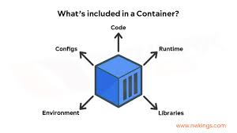

Containers are a streamlined way to build, test, deploy, and redeploy applications on multiple environments from a developer’s local laptop to an on-premises data center and even the cloud. 

## Benefits

- **Less Overhead**
- **Increased Portability**
- **More Consistent Operation**
- **Greater Efficiency**
- **Better Application Development**

## Tangible Things to Do for Adoption

1. **Containerize Your Applications:**
   - Identify the components of your application that can be containerized.
   - Create Dockerfiles to define the container images.
   - Use Docker or other containerization tools to build and run your containers.

2. **Orchestration with Kubernetes:**
   - Implement orchestration using Kubernetes to manage, scale, and automate the deployment of your containerized applications.
   - Define Kubernetes deployment files (YAML) to describe how your application should run in the cluster.
   - Utilize features such as service discovery, load balancing, and scaling.

3. **Implement CI/CD and Monitoring:**
   - Implement Continuous Integration/Continuous Deployment (CI/CD) pipelines to automate the building, testing, and deployment of containerized applications.
   - Integrate monitoring and logging solutions to track the health and performance of your containerized applications and the Kubernetes cluster.
   - Utilize tools like Prometheus, Grafana, or AWS CloudWatch for monitoring and observability.

