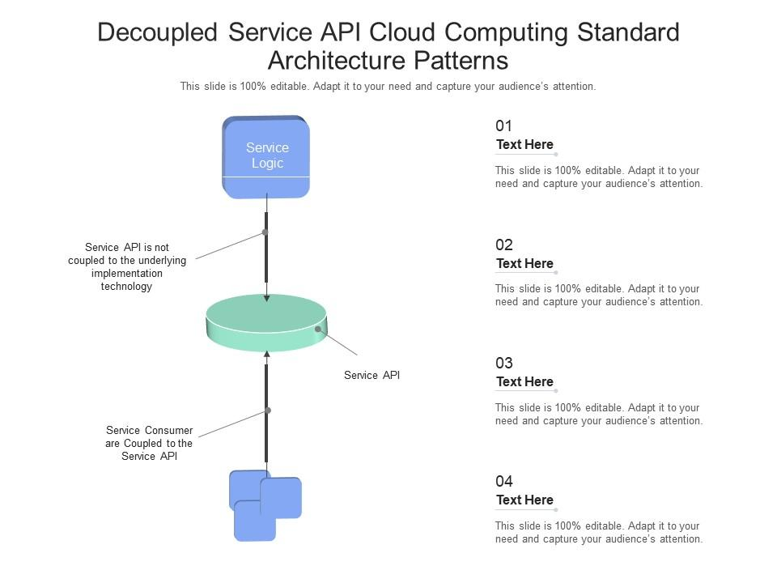

Decoupled services in a cloud-native architecture refer to a design approach where individual components or services within an application are developed, deployed, and operated independently from one another. These services communicate with each other through well-defined APIs or messaging systems, allowing them to work together without being tightly coupled.

## Benefits

- **Scalability**
- **Flexibility**
- **Resilience**
- **Technology Diversity**
- **Ease of Maintenance**

## Tangible Things to Do for Adoption

1. **Identify Service Boundaries and Decompose Applications:**
   - Analyze your application and identify logical boundaries for services.
   - Decompose monolithic applications into smaller, decoupled services.
   - Define clear boundaries and responsibilities for each service.

2. **Design APIs and Communication Patterns:**
   - Design well-defined APIs that expose the functionality of each service.
   - Choose appropriate communication patterns, such as synchronous (RESTful APIs) or asynchronous (message queues).
   - Document APIs comprehensively to make integration easier for developers.

3. **Implement Orchestration and Infrastructure Automation:**
   - Implement orchestration using tools like Kubernetes to manage, scale, and automate the deployment of your decoupled services.
   - Define Kubernetes deployment files (YAML) to describe how your services should run in the cluster.
   - Utilize infrastructure as code (IaC) to automate the provisioning and management of cloud resources.

