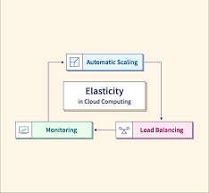

Elasticity in cloud computing is the ability of a system, application, or infrastructure to automatically and dynamically adapt its resource capacity to handle changes in workload or demand. It involves adding or removing computing resources (e.g., virtual machines, storage, or network capacity) in real-time based on fluctuations in the workload, ensuring that the system remains responsive and efficient. Elasticity is a key feature of cloud computing and is often used interchangeably with scalability. However, elasticity specifically focuses on the automatic and on-demand nature of resource provisioning.

## Benefits

- **Cost Efficiency:** Elasticity allows organizations to match their resource usage with actual demand. This results in cost savings, as resources are automatically scaled down during periods of lower demand, preventing over-provisioning and unnecessary expenses.
- **Optimal Resource Utilization:** Elasticity ensures that resources are used efficiently. Scaling resources up or down based on demand prevents underutilization and maximizes the use of available computing power.
- **Scalability on Demand:** Organizations can quickly respond to increased workloads or traffic spikes without manual intervention. This agility is essential for handling seasonal variations, marketing campaigns, or unexpected events.
- **High Availability:** Elastic architectures often incorporate redundancy and failover mechanisms. Resources can be distributed across multiple availability zones or regions, enhancing fault tolerance and ensuring continuous service availability.
- **Consistent Performance:** Elasticity helps maintain consistent performance by automatically provisioning additional resources to meet growing demand. Users experience reliable and responsive services, even during peak usage.

## Tangible Things to Do for Adoption

1. **Workload Assessment:**
   - Analyze current workloads to determine demand patterns.
   - Identify peak usage times and expected growth.

2. **Select the Right Cloud Service Model:**
   - Choose the appropriate cloud service model (IaaS, PaaS, or SaaS) based on your workload requirements.

3. **Application Refactoring:**
   - Refactor applications to make them more cloud-native and scalable.

4. **Auto-Scaling Policies:**
   - Implement auto-scaling policies to automatically adjust resource capacity based on demand.

5. **Load Balancers:**
   - Utilize load balancers to distribute traffic evenly across multiple instances or servers.

6. **Elastic Database Scaling:**
   - Implement elastic database scaling to handle database load variations.

7. **Monitoring and Metrics:**
   - Integrate monitoring and logging solutions to track the health and performance of your resources.

8. **Set Scaling Triggers:**
   - Define scaling triggers based on specific metrics, such as CPU utilization or network traffic.

9. **Optimize Resource Allocation:**
   - Continuously optimize resource allocation to ensure efficient use of cloud resources.

