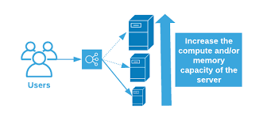

Scalability in cloud computing is the capability of a system, application, or infrastructure to handle an increasing workload or demand by efficiently adding or removing resources (e.g., servers, storage, or network capacity) to maintain or improve performance. Scalability is a fundamental concept in cloud computing, and it allows organizations to adapt to changing workloads and ensure that their services remain available and responsive as demand fluctuates.

## Benefits

- **Performance Optimization:** Scalability ensures that applications and services maintain optimal performance even as user demand fluctuates. Resources can be added or removed dynamically to meet performance requirements.
- **Cost Efficiency:** Scalability helps organizations manage costs effectively. Resources can be scaled up during periods of high demand and scaled down during periods of lower demand, resulting in cost savings.
- **Elasticity:** Elasticity allows resources to automatically scale up or down based on demand, providing a dynamic and efficient way to meet changing needs.
- **Improved User Experience:** Scalable systems can handle increased loads without performance degradation, which leads to a better user experience. Users can access applications and services with minimal latency and downtime.
- **High Availability:** Scalable architectures involve redundancy and failover mechanisms. This enhances the availability of applications and services, reducing the risk of downtime due to failures.

## Tangible Things to Do for Adoption

1. **Assess Workloads:**
   - Analyze current workloads to determine demand patterns.
   - Identify peak usage times and expected growth.

2. **Choose the Right Cloud Service Model:**
   - Choose the appropriate cloud service model (IaaS, PaaS, or SaaS) based on your workload requirements.

3. **Design Stateless Architectures:**
   - Design applications to be stateless to ensure easy horizontal scaling.

4. **Implement Load Balancers:**
   - Utilize load balancers to distribute traffic evenly across multiple instances or servers.

5. **Use Auto-Scaling:**
   - Implement auto-scaling policies to automatically adjust resource capacity based on demand.

6. **Elastic Database Scaling:**
   - Implement elastic database scaling to handle database load variations.

7. **Redundancy and Failover:**
   - Implement redundancy and failover mechanisms to enhance availability.

8. **Implement Caching:**
   - Utilize caching to reduce the load on backend systems and improve performance.

9. **Content Delivery Networks (CDNs):**
   - Implement CDNs to deliver content to users more quickly and efficiently.

