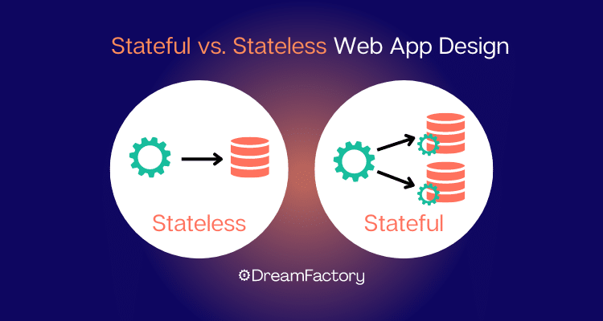

In cloud computing, "statelessness" refers to a design and operational principle where a system or application does not rely on or store significant amounts of state information on the server or individual instances. Instead, stateless systems store most of their data and state information externally, typically in a centralized and shared storage system, a database, or another external service.

## Benefits

- **Scalability:** Stateless systems are easier to scale horizontally. New instances or servers can be added to handle increased load without worrying about the state information tied to a specific instance.
- **Fault Tolerance:** Stateless systems are more fault-tolerant. If an instance fails, it can be replaced without significant disruption because state information is stored externally.
- **Simplified Deployment:** Stateless systems are easier to deploy and manage. It is less complex to spin up new instances since they don't require state transfer or synchronization.
- **High Availability:** Stateless systems can be distributed across multiple regions or data centers, ensuring high availability and reducing the impact of regional failures.
- **Resource Efficiency:** Stateless systems use resources more efficiently. They can quickly allocate resources based on demand and release them when they are no longer needed.
- **Easy Maintenance:** Stateless systems simplify maintenance and updates. Instances can be replaced or updated without the need to migrate state information.

## Tangible Things to Do for Adoption

1. **Externalize State Data:** Identify all state data that your application relies on, such as session information, user data, or temporary variables. Store this state data externally, typically in a database or a shared data store. 

2. **Implement Stateless Microservices:** When designing or refactoring your applications, adopt a microservices architecture where each microservice is stateless and performs a specific function without storing state information.

3. **Session Management:** If your application requires session management, store session data in an external caching or data store like Redis or a cloud-based cache service (e.g., AWS Elasticache or Azure Cache for Redis).

4. **Elastic Scaling:** Take advantage of cloud provider features for auto-scaling based on demand. Stateless components can be easily scaled up or down to accommodate varying workloads.

5. **Use Serverless Computing:** Consider serverless computing platforms, such as AWS Lambda, Azure Functions, or Google Cloud Functions, for stateless functions or tasks that can run independently without maintaining state.

6. **Avoid Sticky Sessions:** If using load balancers, avoid sticky sessions (sessions tied to a specific server). Stateless applications should distribute requests evenly across all available instances.

