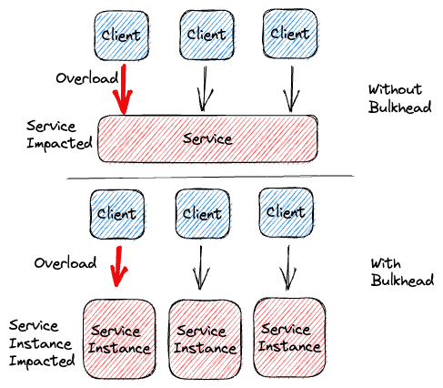

The Bulkhead Pattern is a design pattern used in software development to isolate and contain failures, preventing them from affecting the entire system. This pattern draws inspiration from ship construction, where watertight compartments (bulkheads) are used to prevent a breach in one part of the ship from sinking the entire vessel. By compartmentalizing different parts of the system, you can significantly enhance its resilience and maintain operational continuity, even in the presence of failures.

## Benefits

- **Increased Resilience:**  
  The pattern enhances the overall resilience of the system by preventing failures in one part from cascading and bringing down the entire system.

- **Improved Availability:**  
  By isolating failures, the pattern ensures that other compartments can continue to function, maintaining overall system availability.

- **Resource Management:**  
  Allocating separate resources to different compartments helps prevent resource contention and guarantees that failures in one compartment don't lead to resource exhaustion for others.

- **Better Security:**  
  The pattern can contribute to better security by limiting the attack surface for potential breaches or vulnerabilities.

## Tangible Things to Do for Adoption

1. **Identify Components for Isolation:**  
   Identify the different components, services, or modules within your application that can be isolated to prevent failures from spreading. These could be components that have potential failure points or that perform critical functions.

2. **Implement Isolation Mechanisms:**  
   Implement mechanisms to isolate the identified components. This could involve using separate threads, processes, or even microservices to ensure that failures in one component do not impact others.

3. **Allocate Resources and Define Boundaries:**  
   Allocate appropriate resources (such as threads, memory, or computing power) to each isolated component. Clearly define the boundaries and responsibilities of each compartment to prevent resource contention and ensure that one component's failures do not exhaust resources needed by others.
