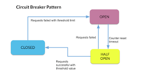

The Circuit Breaker pattern enhances the stability and resilience of systems that communicate with external services or resources, such as APIs, databases, or web services. It prevents cascading failures and provides a fallback mechanism in case the external service becomes unavailable or exhibits poor performance.

## Benefits

- **Fault Isolation:**  
  The pattern prevents failures in one part of the system from propagating to other parts by isolating the problematic service, limiting the impact on the overall system.

- **Improved User Experience:**  
  By quickly failing requests to a troubled external service, the pattern ensures that users are not left waiting for unresponsive services, improving the overall user experience.

- **Resilience:**  
  The Circuit Breaker pattern helps the system remain operational even when external services experience intermittent issues, ensuring graceful degradation rather than complete failure.

- **Fallback Strategies:**  
  Implement fallback strategies, such as using cached data or alternative services, to maintain at least partial functionality during service outages.

## Tangible Things to Do for Adoption

1. **Choose a Circuit Breaker Library or Implement Logic:**  
   Decide whether to use an existing circuit breaker library provided by your programming language or framework (if available) or implement the circuit breaker logic manually. Follow documentation to integrate it into your application.

2. **Set Thresholds and Timeouts:**  
   Determine thresholds for errors, response times, or other metrics triggering the circuit breaker to transition from closed to open states. Set timeouts for how long the circuit breaker should remain open or how many requests it should allow during the half-open state.

3. **Integrate with External Services:**  
   Identify external services or resources your application communicates with. Implement circuit breaker logic around these interactions. Wrap requests to external services with the circuit breaker logic. If the service's response indicates failure or exceeds defined thresholds, trip the circuit breaker.

