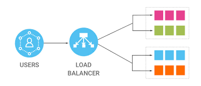

A Load Balancer is a network device or software component that distributes incoming network traffic across multiple servers or resources. This helps ensure high availability, improve performance, and prevent overloading of a single server.

## Benefits

- **High Availability:**  
  Load balancers distribute incoming traffic across multiple servers or resources. If one server becomes unavailable due to maintenance or failure, the load balancer redirects traffic to healthy servers, ensuring continuous service availability.

- **Scalability:**  
  Load balancers make it easier to scale your infrastructure horizontally by adding more servers or resources to handle increasing traffic. This scalability helps accommodate growth and sudden traffic spikes.

- **Redundancy:**  
  Load balancers can be configured with multiple servers that provide the same service. If one server fails, the load balancer can automatically redirect traffic to the remaining healthy servers, providing redundancy and fault tolerance.

## Tangible Things to Do for Adoption

1. **Define Requirements:**  
   Identify the specific requirements for load balancing, such as the type of traffic you need to balance, the expected traffic volume, and the desired scalability.

2. **Select the Right Load Balancer:**  
   Choose the appropriate load balancing solution based on your requirements. Options include hardware load balancers, software load balancers, and cloud-based load balancers.

3. **Design Your Architecture:**  
   Plan your network architecture and the placement of load balancers in your infrastructure. Consider whether you need a single load balancer or a redundant setup for high availability.

4. **Set Up Servers:**  
   Ensure that the backend servers you want to balance are properly configured and ready to receive traffic. This includes setting up multiple servers with the same application or service.
