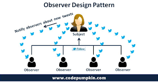

The Observer Design Pattern facilitates building flexible, maintainable, and responsive software systems by establishing a one-to-many relationship between objects, where changes in one object (the subject) trigger updates in its dependents (observers).

## Benefits

- **Loose Coupling:**  
  The Observer pattern promotes loose coupling between subjects and observers, enhancing maintainability and flexibility. Observers rely on a defined interface, allowing them to react to changes without knowledge of subject implementation details.

- **Event Handling:**  
  Well-suited for event-driven programming, the Observer pattern enables asynchronous event handling. Observers respond to various events or state changes, facilitating real-time updates and interaction.

- **Flexibility:**  
  New observers can be added without modifying existing subject classes, and new subject classes can be added without affecting existing observers. This extensibility simplifies system evolution and maintenance.

- **Real-time Updates:**  
  The pattern enables real-time updates between components. When a subject's state changes, dependent observers are immediately notified, enabling timely reactions and synchronization.

## Tangible Things to Do for Adoption

1. **Identify Subject and Observers:**  
   Determine the subject (entity maintaining state) and observers (entities reacting to state changes). Identify interactions and events requiring observation.

2. **Define Interfaces:**  
   Clearly define interfaces for subjects and observers, including methods for attaching, detaching, and notifying observers. Ensure interfaces are well-documented.

3. **Implement Concrete Classes:**  
   Create concrete classes for subjects and observers, implementing defined interfaces. Subjects maintain a list of observers and notify them of state changes. Observers implement update methods to react to changes.

