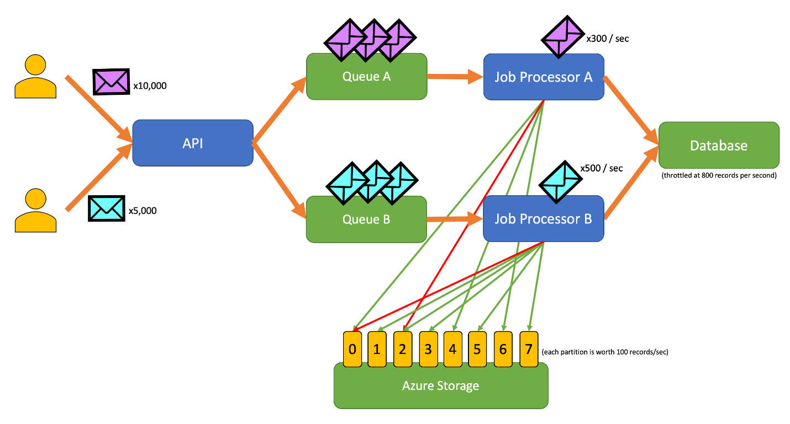

Rate limiting is a critical strategy for controlling network traffic and preventing abusive or excessive requests to a server or resource. It helps maintain the availability and performance of the system while mitigating the risk of denial-of-service (DoS) attacks.

## Benefits

- **Prevent DoS Attacks:**  
  Rate limiting makes it difficult for attackers to execute DoS attacks by limiting the rate of requests, preventing overwhelming the server.

- **Resource Utilization:**  
  By managing the rate of requests, rate limiting optimizes resource utilization, ensuring fair access to resources and preventing resource exhaustion.

- **Prevent Abuse:**  
  Rate limiting prevents abuse by limiting the number of requests a user or group can make within a specific time frame, preventing monopolization of resources.

- **Improve User Experience:**  
  By preventing server overload and maintaining responsiveness, rate limiting enhances the user experience, ensuring timely access to resources.

## Tangible Things to Do for Adoption

1. **Identify Use Cases:**  
   Identify use cases where rate limiting is necessary, such as API abuse prevention, protection against DDoS attacks, or managing server resource utilization.

2. **Define Rate Limits:**  
   Define rate limits for each use case, specifying the maximum number of requests allowed within a given time window.

3. **Choose Rate Limiting Tool:**  
   Select a rate limiting tool or service that aligns with your technology stack and requirements, considering factors like scalability and ease of integration.

4. **Implement Rate Limiter:**  
   Integrate the rate limiter into your application code or infrastructure, ensuring that it effectively enforces rate limits and handles exceeded limits gracefully.

5. **Define Response to Exceeding Limits:**  
   Define how your application should respond when a client exceeds the rate limit, such as returning an HTTP error with rate limit status and reset time.

