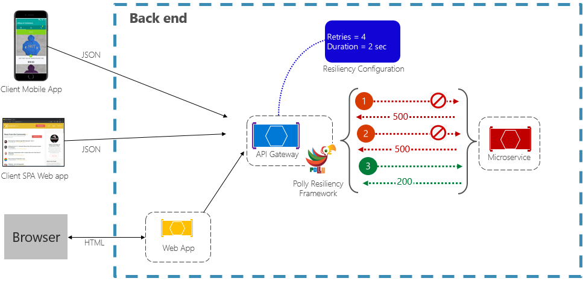

The Retry Pattern is a design pattern used in software development to handle transient failures that might occur when interacting with external resources, services, or systems. It is especially useful for scenarios where the failure is expected to be short-lived, such as network glitches or temporary resource unavailability.

## Benefits

- **Resilience:**  
  The Retry Pattern improves the resilience of applications by allowing them to recover from transient failures without manual intervention.

- **Reduced User Impact:**  
  Users experience fewer disruptions as the system automatically retries failed operations, leading to a smoother user experience.

- **Temporary Failures Handling:**  
  The pattern is particularly effective for addressing temporary issues like network timeouts, server overloads, or service unavailability.

- **Improved Availability:**  
  By automatically recovering from transient failures, the pattern contributes to better overall system availability.

## Tangible Things to Do for Adoption

1. **Identify Target Operations:**  
   Identify the specific operations, interactions, or requests that you want to apply the retry pattern to. These could involve communication with external services, APIs, or resources.

2. **Wrap Operations with Retry Logic:**  
   Implement a retry mechanism around the target operations. When a failure occurs, automatically retry the operation based on the defined retry count and interval. Optionally, implement a backoff strategy to gradually increase the interval between retries.

3. **Monitor and Fine-Tune:**  
   Regularly monitor the success rate of the retried operations. If you observe patterns of transient failures, adjust the retry count, interval, or backoff strategy to better match the characteristics of the failures.

