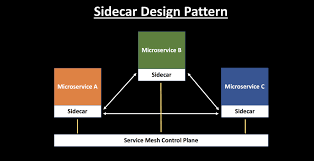

A sidecar is a separate container that runs alongside an application container in a Kubernetes pod. It is responsible for offloading functions required by all apps within a service mesh, such as SSL/mTLS, traffic routing, high availability, and more. It is also used to aggregate and format log messages from multiple app instances into a single file.

## Benefits

- **Language Independence:**  
  A sidecar is independent from its primary application in terms of runtime environment and programming language, so you don’t need to develop one sidecar per language.

- **Resource Access:**  
  The sidecar can access the same resources as the primary application.

- **Loose Coupling:**  
  It provides loose coupling between the application code and the platform.

- **Code Duplication Reduction:**  
  Code duplication is reduced in a microservice architecture since there is no need to write configuration code inside each container.

## Tangible Things to Do for Adoption

1. **Select a Sidecar Technology:**  
   Choose a sidecar technology or proxy that suits your specific requirements. Popular options include Envoy, Nginx, HAProxy, and Istio. Evaluate the features, performance, and community support of the chosen technology.

2. **Containerization:**  
   If you're not already using containerization (e.g., Docker), containerize your microservices and their associated sidecars. This makes it easier to manage and deploy them in a consistent and scalable manner.

