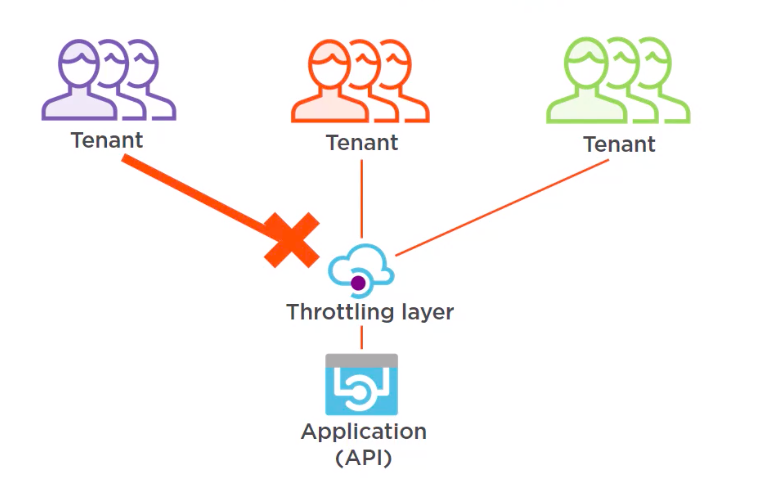

The Throttling Pattern is a design pattern used in software development to control the rate of execution for certain actions, requests, or operations. It is employed to limit the frequency or volume of actions performed by a system or a user to prevent overload, resource exhaustion, and performance degradation.

## Benefits

- **Resource Protection:**  
  Throttling prevents excessive utilization of resources, ensuring that the system remains responsive and available for all users.

- **Avoid Performance Degradation:**  
  By limiting the rate of incoming requests, the pattern prevents overload situations that could lead to performance degradation or service outages.

- **Prevent Abuse:**  
  Throttling helps prevent abuse or misuse of a system's functionalities. It can deter unauthorized access attempts or excessive data retrieval.

- **Backpressure Handling:**  
  When combined with a queuing mechanism, the pattern allows the system to handle excess requests gracefully, delaying execution until resources are available.

## Tangible Things to Do for Adoption

1. **Identify Targeted Actions:**  
   Identify the specific actions, requests, or operations that you want to throttle. These could be resource-intensive tasks, API calls, or any other actions that could potentially overload the system.

2. **Define Throttling Parameters:**  
   Determine the rate limits for the targeted actions. Decide on the maximum allowed frequency (e.g., requests per second) for each action. You might also consider how to handle exceeded limits, such as rejecting requests or queuing them for later processing.

3. **Implement Throttling Logic:**  
   Integrate the throttling logic into your codebase. Wrap the targeted actions with the throttling logic, which checks the rate limits before allowing an action to proceed. If the limit is exceeded, take appropriate actions like delaying the request, returning an error response, or queuing the request.
