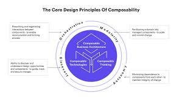

In software architecture, "composable" refers to the design principle where software components or modules are created in a way that makes them easy to combine and assemble into larger, more complex systems. Composability is particularly valuable in complex software systems, where it promotes maintainability, extensibility, and adaptability. It also encourages the development of a rich ecosystem of reusable components and libraries, which can significantly accelerate the software development process and reduce the likelihood of errors.

## Benefits

- **Modularity:** Composable software architectures are composed of well-defined and self-contained modules or components. Each module serves a specific purpose and has clear interfaces for interaction with other modules.
- **Reusability:** Composable components are designed to be reusable in multiple contexts. Instead of reinventing the wheel, developers can leverage existing components to speed up development and reduce redundancy.
- **Interoperability:** Composable components should work seamlessly together, regardless of their origins or the technologies they are built with. Interoperability ensures that components can communicate and cooperate effectively.
- **Flexibility:** Composability allows for flexibility in system design. Developers can assemble or rearrange components to adapt to changing requirements or create custom solutions tailored to specific needs.
- **Scalability:** Composable architectures can scale easily. Additional instances of components can be added, and new components can be introduced to handle increased workloads or extend functionality.
- **Plug-and-Play:** Composability enables a "plug-and-play" approach, where new components or features can be integrated into a system with minimal modification to the existing structure.

## Tangible Things to Do for Adoption

### Identify Components

Identify the logical components or modules within your software system. Break down the system into smaller, self-contained units of functionality. These can be at different levels, such as functions, classes, libraries, or services.

### Define Clear Interfaces

Define clear and well-documented interfaces for your components. These interfaces should specify how components can be used, what they require as input, and what they provide as output. Use consistent naming conventions and documentation to make the interfaces understandable.

### Reusability

Design components with reusability in mind. Avoid building one-off solutions for specific tasks when you can create more general-purpose components that can be used in various contexts.

### Dependency Management

Manage dependencies between components carefully. Minimize dependencies between components to reduce coupling and enhance composability. Use dependency injection or inversion of control where applicable.

### Standardize Data Formats

Standardize data formats and communication protocols between components. This ensures that different components can understand and interact with each other's data.
