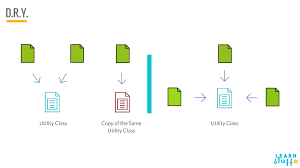

The DRY (Don't Repeat Yourself) principle states that "Every piece of knowledge must have a single, unambiguous, authoritative representation within a system". The way to achieve DRY is by creating functions and classes to make sure that any logic should be written in only one place.

## Benefits

- **Code Reusability:** DRY encourages you to encapsulate reusable logic and functionality in a single place. By avoiding duplication of code, you make it easier to reuse that code throughout your application. This reduces the need to rewrite or update the same logic in multiple places, saving time and effort.
- **Maintenance and Consistency:** When code is duplicated in multiple places, it becomes challenging to maintain and keep consistent. Any changes or bug fixes need to be applied in each location, increasing the risk of introducing errors or inconsistencies. DRY code is easier to maintain because you only need to update it in one location.
- **Readability:** DRY code is typically more readable because it eliminates redundancy. Redundant code can make your codebase longer and more complex, making it harder for developers to understand and work with. Clean, DRY code is easier to comprehend and work with.
- **Bug Reduction:** Code duplication increases the risk of introducing bugs. When you make a change in one part of the code but forget to update another identical section, it can lead to inconsistencies and errors. By adhering to the DRY principle, you minimize the chances of such issues.
- **Code Quality and Maintainability:** Ultimately, following the DRY principle leads to higher code quality and better maintainability. Your codebase becomes more organized, less error-prone, and easier to manage, which is crucial for long-term software projects.

## Tangible Things to Do for Adoption

- Encourage regular code reviews within your team. Reviewers can check for code duplication and suggest ways to refactor and make it DRY.
- Define coding standards and guidelines for your team that emphasize the DRY principle.
- Use code analysis tools and linters that can detect code duplication and violations of DRY principles.
- Break your code into smaller, reusable modules or functions. This not only promotes code reusability but also makes it easier to identify and eliminate duplication.
