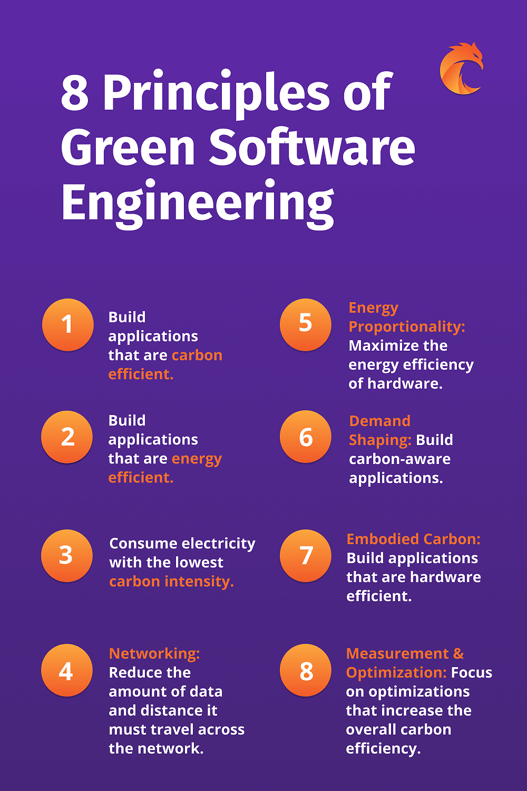

# Green Coding 

"Green coding" refers to the practice of developing software with an emphasis on environmental sustainability and energy efficiency. Here are some aspects and practices associated with green coding:

## Efficient Algorithms and Code

Design and implement efficient algorithms to minimize computational resource usage. Write code that optimizes CPU and memory utilization to reduce energy consumption.

## Resource Management

Properly manage and release resources (memory, file handles, network connections) to avoid unnecessary energy consumption and improve system efficiency.

## Optimized Compilation

Optimize code compilation to produce efficient and lightweight binaries, reducing the energy required during the build process.

## Energy-Aware Development Tools

Use development tools and environments that provide insights into energy consumption. Some tools can analyze code and identify areas where optimizations can be made for efficiency.

## Green Hosting and Cloud Services

Choose hosting providers and cloud services that prioritize renewable energy sources and have green data center initiatives.

## Code Reviews for Efficiency

Conduct code reviews with a focus on energy efficiency. Encourage team members to identify and discuss areas where code optimizations can lead to reduced resource usage.

## Caching and Optimization

Implement caching strategies to reduce the need for repetitive computations or data retrieval, leading to lower energy consumption.

## Energy-Efficient UI/UX

Design user interfaces that are energy-efficient, considering factors like animation complexity, image sizes, and overall rendering performance.

## Energy Monitoring and Reporting

Implement energy monitoring tools within applications to track and report energy consumption. This transparency can lead to better decision-making in terms of optimizations.

## Renewable Energy Credits

Consider purchasing renewable energy credits to offset the environmental impact of the energy used during software development and deployment.
