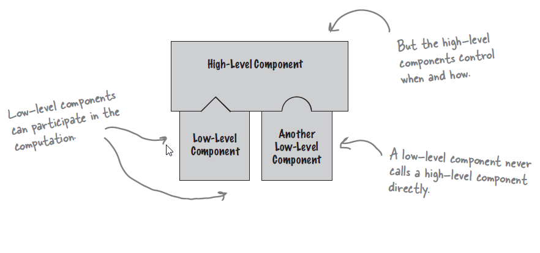

The Hollywood Principle, often summarized with the phrase "Don't call us, we'll call you," is a design principle used in various software and architectural contexts. It is also known as the Inversion of Control (IoC) principle. This principle emphasizes the following key ideas:

- **Inversion of Control:** In traditional software design, the flow of control is typically determined by the application or the developer. In contrast, the Hollywood Principle suggests that control should be inverted or shifted to a framework or container, allowing it to manage and control the flow of the application.
- **Framework or Container Driven:** The Hollywood Principle implies that the framework, library, or container will call or invoke certain functions, methods, or components when needed, rather than the developer explicitly calling them.

In summary, the Hollywood Principle, or Inversion of Control, promotes loose coupling, separation of concerns, and flexible, maintainable software architectures.

## Benefits

- **Reduced Coupling:** By minimizing direct dependencies between components, it reduces coupling, making the codebase less prone to bugs and easier to test in isolation.
- **Scalability:** In a system following the Hollywood Principle, adding new features or services can be done without having to modify existing code. This scalability is vital for applications that need to evolve over time.
- **Ease of Maintenance:** A codebase that follows the Hollywood Principle is generally easier to maintain because of its modular and self-contained nature. Changes and updates can be made to individual components without affecting the entire system.
- **Flexibility:** The Hollywood Principle makes your software more flexible and extensible. It enables you to add or replace components without requiring changes in the rest of the system. This flexibility is essential for maintaining and evolving software over time.

## Tangible Things to Do for Adoption

1. Choose a suitable framework or container that supports inversion of control. Common examples include Spring (for Java), Angular (for web development), or a custom dependency injection container.
2. Embrace dependency injection as a primary mechanism for achieving IoC. Instead of creating and managing dependencies within your components, inject them into your classes from the outside. This reduces coupling and allows the framework to control the component's lifecycles.
3. Implement event handlers or listeners for specific events or triggers in your application. These event handlers are then registered with the framework or container to be invoked when the corresponding events occur.
4. Manage configuration settings in a way that the framework can access and modify them as needed. This allows the framework to control the behaviour of your application without requiring code changes.
5. Use dependency injection tools or features provided by your chosen framework to automate the injection of dependencies into your components. Avoid manual dependency management whenever possible.
