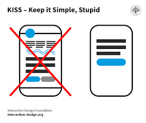

The KISS principle in software design stands for "Keep It Simple, Stupid" or "Keep It Simple and Straightforward." It is a fundamental guideline for software development that emphasizes simplicity in design and implementation. The primary benefit of adhering to the KISS principle is to create software that is easier to understand, maintain, and less error-prone.

## Benefits

- **Ease of Understanding:** Simple code and design are easier for developers to understand. When code is straightforward and not overly complex, it becomes more accessible to team members, including new developers who need to work on the project.
- **Reduced Maintenance Burden:** Simple code is easier to maintain. It's less likely to contain hidden complexities that can lead to hard-to-debug issues. Maintenance tasks, such as bug fixes and updates, are quicker and less error-prone.
- **Reduced Risk of Errors:** Complexity introduces more opportunities for errors and bugs. Simplifying code and design reduces the chances of introducing errors during development or maintenance.
- **User-Friendly Interfaces:** Simple and straightforward user interfaces (UI) are more user-friendly. Users can quickly understand and interact with the software, resulting in a better user experience.
- **Maintainability and Longevity:** Simplicity is key to long-term maintainability. Software that is simple and straightforward is more likely to stand the test of time, as it can be easily updated and adapted to changing requirements.

## Tangible Things to Do for Adoption

1. Clearly define the objectives and requirements of your software project. Ensure that you and your team have a comprehensive understanding of what needs to be achieved.
2. Begin with the minimum necessary features and components to meet the project's objectives. Avoid adding unnecessary complexity from the outset.
3. Use meaningful and descriptive names for variables, functions, classes, and other code entities. This makes it easier for anyone reading the code to understand its purpose.
4. Do not over-engineer your solutions. Only add abstractions, design patterns, or optimizations when they are clearly required to meet project objectives or solve specific problems.
5. Aim for short, focused functions and methods. If a function becomes too long or complex, consider breaking it down into smaller, more manageable parts.
6. Whenever possible, leverage standard libraries and tools that simplify common tasks. Avoid reinventing the wheel and introducing unnecessary complexity.
7. Regularly review and refactor your codebase to simplify and improve it. Identify and remove unnecessary complexity as part of this process.
8. Continuously iterate on your software, soliciting feedback and reviewing the code for complexity. Aim to simplify with each iteration.
