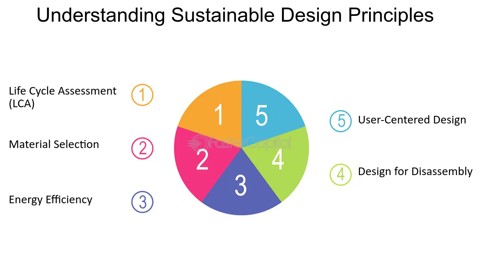

LIFESPAR is a set of cloud native architectural principles that stands for:

- **Latency-aware**
- **Instrumented**
- **Failure-aware**
- **Event-driven**
- **Secure**
- **Parallelizable**
- **Automated**
- **Resource-consumption-aware**

## Benefits

- **Design to Fail:** Being aware of failure points, it promotes a design-to-fail strategy.
- **Latency:** It encourages a latency-driven testing approach to ensure the system meets expected latency numbers.
- **Automation:** It promotes automation by encouraging the building of self-maintainable services that can be automatically started and stopped.
- **Decoupled Services:** It promotes developing decoupled, independent services that are event-driven. This further simplifies scaling and makes the whole system resilient to failures.

## Tangible Things to Do for Adoption

1. **Analyse Legacy Applications:** Analyse the existing legacy application and identify boundaries to create decoupled services. Encourage a microservices-driven architecture.
2. **Identify Failure Scenarios:** Identify failure scenarios and points and add mechanisms for resiliency.
3. **Instrumentation:** Integrate external instrumentation tools or write instrumentation logic in your code to generate sufficient and relevant data about your APIs.
4. **Security and Automation:** Use necessary cloud services to make your services secure and automated.

