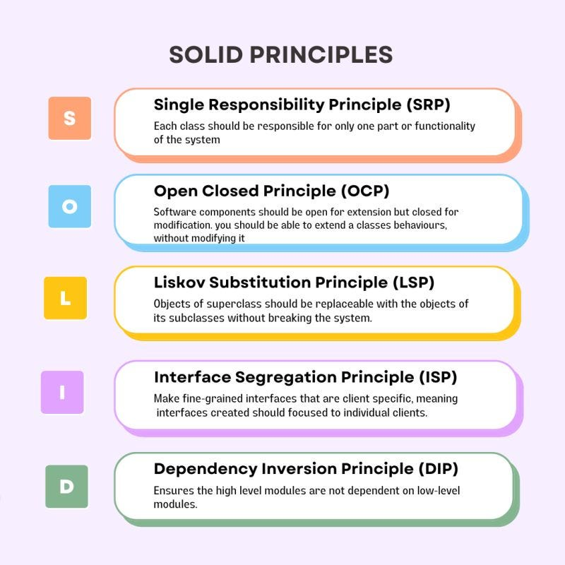

SOLID is an acronym that represents a set of five design principles for writing maintainable and scalable software. These principles were introduced by Robert C. Martin and are widely used in object-oriented programming. Each letter in SOLID stands for one of the five principles: Single Responsibility Principle(SRP), Open/Closed Principle (OCP), Liskov Substitution Principle (LSP), Interface Segregation Principle (ISP), and Dependency Inversion Principle (DIP).

## Benefits

- **Maintainability:** SOLID principles promote code that is easier to understand, modify, and extend. This results in software that is more maintainable over time.
- **Flexibility and Extensibility:** By adhering to the Open/Closed Principle (OCP) and the Dependency Inversion Principle (DIP), your code becomes more flexible and extensible. You can add new features or components without having to modify existing code, reducing the risk of unintended side effects.
- **Scalability:** SOLID principles contribute to the scalability of your software. When your codebase is well-organized, with clear separation of concerns and reduced coupling between components, it's easier to scale the application to meet growing requirements and user demands.
- **Reduced Code Duplication:** Following SOLID principles, especially the Single Responsibility Principle (SRP), reduces code duplication.
- **Improved Code Quality:** SOLID principles lead to improved code quality. Code that adheres to these principles is typically cleaner, less error-prone, and more organized.
- **Reduced Risk of Bugs and Issues:** Following SOLID principles helps reduce the risk of introducing bugs and issues when making changes or adding new features. The principles encourage code that is less fragile and more stable.

## Tangible Things to Do for Adoption

1. Implement a rigorous code review process that includes checks for adherence to SOLID principles. Code reviews are an excellent opportunity to identify violations and provide feedback for improvement.
2. Offer concrete examples and use cases to demonstrate how adhering to SOLID principles can improve code quality, maintainability, and scalability.
3. Break down code into smaller, focused modules or classes, each following the Single Responsibility Principle (SRP). Avoid creating monolithic classes that do too much.
4. Make refactoring a regular part of the development process. Encourage developers to refactor code that violates SOLID principles as part of ongoing improvement efforts.
5. Use metrics and code analysis tools to measure progress in adhering to SOLID principles over time. Set goals for improvement and track them.
