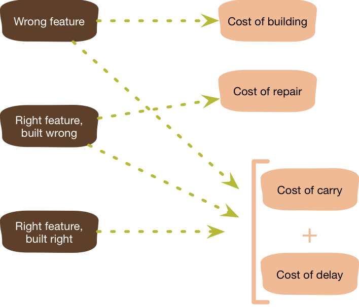

YAGNI is an Extreme Programming (XP) practice which states: "Always implement things when you actually need them, never when you just foresee that you need them.“. It's a principle in software development that suggests developers should not implement features or functionality until they are needed to address specific requirements or solve real problems. In other words, it encourages developers to avoid adding unnecessary or speculative features to their software.

## Benefits

- **Simplicity:** YAGNI promotes simplicity in software design and implementation. By only adding what's currently needed, your codebase remains straightforward and easier to understand.
- **Focus:** Developers can concentrate on delivering the essential features that directly address user needs and project requirements. This avoids distractions caused by speculative features.
- **Reduced Maintenance Burden:** Unnecessary code and features can become a maintenance burden, leading to additional work and potential bugs. YAGNI helps minimize this overhead.
- **Faster Development:** With less code to write and maintain, development can be faster and more efficient.
- **Risk Mitigation:** Implementing features that aren't needed can introduce unforeseen risks. By adhering to YAGNI, you minimize the risk of introducing errors or complications that may never be relevant.

## Tangible Things to Do for Adoption

1. Clearly define and prioritize project requirements based on user needs and business goals. Identify the most critical and high-priority features.
2. Develop a minimum viable product (MVP) that includes only the essential features necessary to address the immediate needs of users. This provides a starting point for your application.
3. Document user stories and use cases to capture user requirements. Focus on addressing these stories and cases and avoid adding features that don't directly relate to them.
4. Maintain a feature backlog where you can capture ideas and potential features. Prioritize these features based on user feedback and evolving project needs.
5. Include YAGNI checks in code reviews. Review code to ensure it doesn't include unnecessary or speculative features.
6. Collect and act on user feedback to determine which features are genuinely needed and which can be omitted or de-prioritized.
7. Regularly review your codebase and consider refactoring to remove features or code that are no longer relevant or necessary.
8. Use monitoring and analytics tools to track how users interact with your application. This data can inform decisions about which features to prioritize or remove.
