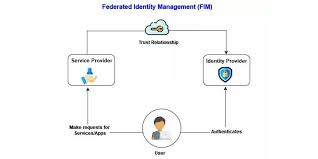

Federated identity is a concept in identity and access management where multiple organizations or systems trust each other to authenticate users. It allows users to access multiple services or systems with a single set of credentials, often across different domains or organizations.

## Benefits

- **Single Sign-On (SSO):**  
  Users can log in once and access multiple systems or applications without the need to re-enter their credentials. This simplifies the user experience and reduces the burden of remembering multiple passwords.

- **Improved User Experience:**  
  Federated identity provides a seamless and consistent login experience across different services, which enhances user satisfaction and engagement.

- **Enhanced Security:**  
  Federated identity systems often include advanced security features, such as multi-factor authentication (MFA), which can strengthen security across multiple services.

## Tangible Things to Do for Adoption

1. **Infrastructure Setup:**  
   Set up the technical infrastructure required for federated identity, including Identity Provider (IdP) and Service Provider (SP) configurations. This involves installing and configuring the necessary software and hardware.

2. **Authentication Methods:**  
   Define the authentication methods and mechanisms to be used, such as multi-factor authentication (MFA), single sign-on (SSO), or adaptive authentication based on the risk profile of the user or transaction.

3. **Identity Attribute Mapping:**  
   Establish a clear mapping of user attributes and attributes requested by service providers. Determine what information will be shared and under what conditions.

