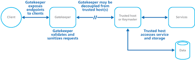

A gatekeeper is a component that controls access to a particular resource or system. It enforces access control policies and can validate and authorize requests based on predefined rules.

## Benefits

- **Access Control:**  
  Gatekeepers provide a centralized point of control for managing access to specific resources or functionalities. This helps in enforcing security policies and access restrictions.

- **Security Enhancement:**  
  By restricting access through a gatekeeper, you can reduce the risk of unauthorized users gaining access to sensitive data or critical system functions. This is particularly important for protecting against security breaches and data leaks.

- **Authorization:**  
  Gatekeepers can enforce authorization policies, ensuring that only authorized users or roles can access specific resources. This helps maintain the principle of least privilege.

## Tangible Things to Do for Adoption

1. **Define Access Control Requirements:**  
   Clearly define your access control requirements, specifying which resources or functionalities need protection, and who should have access to them.

2. **Identify Access Control Policies:**  
   Identify and establish access control policies that define who can access what resources and under what conditions. This includes defining roles, permissions, and access rules.

3. **Select a Gatekeeper Solution:**  
   Choose an access control solution or tool that suits your specific requirements. This could be a third-party access control system or a custom-built component integrated into your application.
