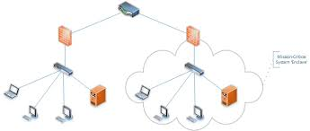

Network segmentation is a cybersecurity strategy that involves dividing a computer network into smaller, isolated segments or subnetworks to enhance security, manage traffic, and control access. The primary goal of network segmentation is to reduce the attack surface and prevent lateral movement by attackers within a network. This approach limits the potential impact of a security breach by compartmentalizing the network and implementing security controls at various levels.

## Benefits

### Enhanced Security

- **Reduced Attack Surface:** Segmentation limits the exposure of critical assets to potential attackers. Even if one segment is compromised, it doesn't automatically grant access to other segments.
- **Isolation of Threats:** In the event of a security breach, network segmentation confines the breach to a specific segment, preventing it from spreading throughout the entire network.

### Access Control

- **Granular Access Control:** Network segments can have specific access controls and policies tailored to the needs of the users and devices within them. This ensures that only authorized users and systems can access resources.

### Regulatory Compliance

- **Compliance with Regulations:** Network segmentation can help organizations meet regulatory and compliance requirements, especially when dealing with sensitive or personal data.

### Improved Network Performance

- **Optimized Traffic Management:** Segmentation allows for better traffic management and resource allocation, which can lead to improved network performance and reduced congestion.

## Tangible Things to Do for Adoption

- **Define Segmentation Goals:** Clearly define the objectives of network segmentation, including improved security, access control, and compliance.
- **Network Inventory:** Document all devices, systems, and resources in your network. Identify critical assets and data that require segmentation.

# Segmentation Strategy

Develop a segmentation strategy based on your organization's specific needs. Decide on the segmentation approach, such as VLANs, subnets, or micro-segmentation.

## Access Control Policies

Create access control policies that specify who can access which resources within each segment. Define user roles and responsibilities.

## Network Design

Design the network architecture to implement the segmentation strategy. Consider how data will flow between segments and how traffic will be routed.

## Firewall Rules

Configure firewall rules to enforce access policies and control traffic between segments. Ensure that firewalls are placed at appropriate network boundaries.

## VLAN Configuration

If using VLANs, configure switches and routers to support virtual LANs. Ensure that devices are correctly assigned to their respective VLANs.

## Subnetting

Divide the IP address space into subnets to create network segments. Configure routers and switches accordingly.

## Micro-Segmentation Tools

If implementing micro-segmentation, select and deploy appropriate tools and solutions that enable fine-grained control over network traffic.

## Access Control Lists (ACLs)

Use ACLs to control traffic at the network layer. Define and apply ACLs to routers and switches to restrict traffic between segments.

